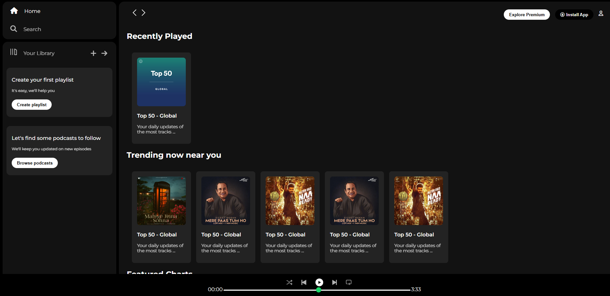

# Spotify Web Player Clone 🎵



A pixel-perfect, front-end clone of the Spotify Web Player interface built purely with **HTML5** and **CSS3**. This project was developed to demonstrate mastery over complex UI layouts, CSS Flexbox, semantic HTML structuring, and responsive design by recreating one of the most recognizable web applications in the world.

## ✨ Key Features & Interface

### The Layout
- **Authentic Dark Theme**: Accurately replicates Spotify's signature deep dark background, typography, and accent colors.
- **Multi-Pane Architecture**: Seamlessly divides the viewport into three distinct areas: a fixed left sidebar, a scrollable main content area, and a persistent bottom music player.

### Sidebar Navigation
- Features intuitive navigation links (Home, Search, Your Library) with smooth opacity transitions on hover.
- Includes integrated action cards prompting users to "Create your first playlist" and "Browse podcasts."

### Main Content Area
- **Sticky Navigation Bar**: A semi-transparent top header containing history navigation arrows, 'Explore Premium' badges, and an 'Install App' button.
- **Album Grids**: Categorized horizontal scrolling sections such as *Recently Played*, *Trending now near you*, and *Featured Charts*.
- **Card Components**: Individual album/playlist cards complete with cover images, bold titles, and subtle descriptive text.

### Persistent Music Player
- **Bottom Control Bar**: A fixed player panel that remains accessible regardless of where the user scrolls.
- **Playback Controls**: Features custom-styled play, pause, skip, and shuffle icons.
- **Progress Bar**: Uses a custom-styled HTML `<input type="range">` element to simulate track progression perfectly matching Spotify's green/white hover styling.

## 🛠️ Technology Stack

- **HTML5**: Clean, semantic markup to define the complex dashboard structure.
- **CSS3**: 
  - Extensive use of **Flexbox** to perfectly align icons, text, and nested containers.
  - Custom scrollbars to hide the ugly browser defaults while retaining scrolling functionality.
  - Hover states and transition effects for interactive feedback.
- **Typography**: Integrated the **'Montserrat'** font family via Google Fonts to match the sleek, modern feel of the original app.
- **Icons**: Leveraged **FontAwesome 6** for crisp, scalable vector icons alongside native `.png` assets.

## 📂 Project Structure

```text
Spotify-Clone/
├── index.html           # Core HTML layout and component markup
├── style.css            # Stylesheet defining flex layouts, colors, and typography
├── images/              # (Assumed) Directory containing album covers and custom UI icons
├── card1img.jpeg        # Various playlist cover images
├── player_icon1.png     # Custom icons for the bottom music player
└── README.md            # Project documentation
```

## 🚀 Getting Started

Since this is a static front-end project, running it is instantaneous:

1. Clone or download this repository.
2. Ensure all `.png` and `.jpeg` image files are in the same directory as the HTML file.
3. Open the `index.html` file in any modern web browser (Chrome, Firefox, Safari).
4. *No servers, installations, or build tools are required!*

## 💡 What I Learned

Building this clone was a fantastic deep-dive into advanced CSS architecture. It provided hands-on experience with:
- Managing a complex, three-pane layout where the sidebar and footer remain fixed while the main content scrolls.
- Fine-tuning Flexbox properties (`justify-content`, `align-items`, `gap`) to pixel-perfect match a professional design.
- Styling native HTML input sliders to look like modern UI components.

## 📝 License

This project is open-source and intended for educational and portfolio purposes.
